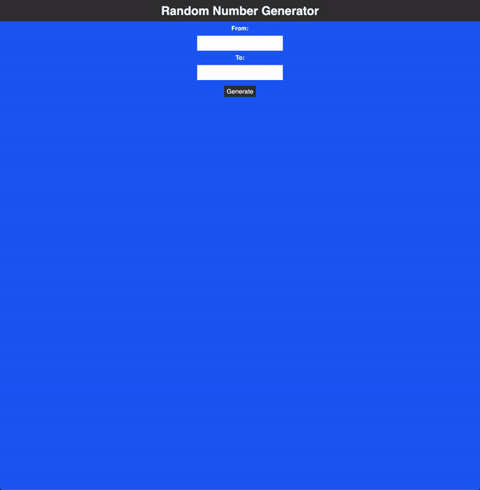

### Random Number Creater

> Create random number in a given range.

## Live Demo

Preview: https://pirci.github.io/random-number/

## What I Learned:

- Practice **querySelector** with project.
- Using **parseInt** method.
- Using function **addEventListener()**.
- Basic HTML and CSS structure & style.

## Possible Improvements

> Any type of suggestions/improvements to this repo are always welcome.
